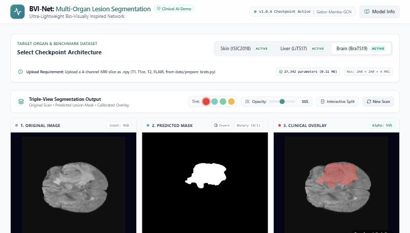

# BVI-Net — Ultra-Lightweight Multi-Organ Medical Image Segmentation

Replication of **"Ultra-Lightweight Network for Medical Image Segmentation Inspired by
Bio-Visual Interaction"** (Cai, Fan, Zhu, Fang — *IEEE TCSVT*, Vol. 35, No. 4, April 2025,
DOI: 10.1109/TCSVT.2024.3507383), trained on all three tasks from the paper — **skin lesions
(ISIC2018), liver + liver tumor (LiTS17) and brain glioma (BraTS19)** — and served through a
web dashboard that runs the trained models on uploaded scans.

Every model has **~27K parameters (0.11 MB)** and uses the real Mamba selective scan.

---

## 1. Results (held-out test sets)

| Organ | Dataset / split | Params | Class | Dice | Global Dice¹ | mIoU | Sens. | Spec. |
|---|---|---|---|---|---|---|---|---|
| Skin | ISIC2018 — 2335 train / 100 official val / 259 test | 27,312 | Lesion | **0.863** | — | 0.782 | 0.902 | 0.971 |
| Liver | LiTS17 — 131 volumes, 91/13/27 by patient, 3834 slices | 27,277 | Liver | 0.828 | **0.928** | 0.773 | 0.840 | 0.995 |
| | | | Tumor | 0.661 | **0.567** | 0.627 | 0.162 | 0.999 |
| Brain | BraTS19 LGG — 76 cases, 7:1:2 by patient, 2463 slices | 27,342 | WT | 0.705 | **0.862** | 0.626 | 0.710 | 0.996 |
| | | | TC | 0.593 | **0.711** | 0.512 | 0.511 | 0.995 |
| | | | ET | 0.753 | **0.744** | 0.722 | 0.162 | 1.000 |

¹ **Global Dice** pools every test pixel per class. The per-image Dice/Sens columns average
over slices, and a slice with no tumor scores Dice = 1 when the model predicts nothing, so for
the small classes (tumor, TC, ET) the global Dice is the trustworthy number. Skin has a lesion
in every image, so both coincide.

Kaggle runs (notebook `notebooks/kaggle-multi-organ.ipynb`, GPU T4): skin = version 1,
brain = version 6, liver = version 7 + fine-tune with 3× tumor-slice oversampling (version 8). Metrics JSONs are in `checkpoints/bvi_net_<organ>_metrics.json`.

---

### Inference speed (batch 1, `benchmark.py`)

| Organ | Input | Tesla T4 (Kaggle, CUDA Mamba) | Laptop CPU (Mamba port) |
|---|---|---|---|
| Skin | 256×256×3 | 21.2 ms — **47 FPS** | ~4 s |
| Brain | 240×240×4 | 21.6 ms — **46 FPS** | ~5–11 s |
| Liver | 448×448×1 | 33.9 ms — **30 FPS** | ~16–31 s |

The paper reports 292 FPS. Our FA-VSSM calls Mamba once per scan direction (4×) with Python-side
gather/scatter permutations, and a 27K-parameter network is dominated by that per-call overhead
rather than by FLOPs. `models/fa_vssm.py` now runs the 4 scans as one batched Mamba call (outputs
identical to 2e-9); the T4 numbers above were measured before that change.
Raw numbers: `docs/benchmark_gpu.json`.

---

## 2. The model

| Component | File | Inspired by | What it does |
|---|---|---|---|
| Local Pathway | `models/gabor_conv.py` | Ventral stream (detail) | Gabor-initialised convolutions tuned to V1/V2/V4 orientation bias — fine boundaries |
| Global Pathway (FA-VSSM) | `models/fa_vssm.py` | Dorsal stream (fast, global) | Mamba selective scan over 4 scan orders (row/column/Z-curve/Hilbert) + pooled fast attention |
| GCN Attention skip | `models/gcn_attention.py` | Multi-level integration | Projects features to a graph, graph convolution, refines skip features while decoding |
| Full network | `models/bvi_net.py` | — | Encoder–decoder, channels 4-8-8-16-16, 8 GCN nodes; Global guides Local by multiplication |
| CPU Mamba port | `models/mamba_ref.py` | — | Pure-PyTorch, parameter-compatible `mamba_ssm.Mamba` (vectorised log-space scan) |

Loss: BCE + Dice (Eq. 9, λ₁ = λ₂ = 1). Optimiser AdamW, lr 1e-3, ReduceLROnPlateau, early stopping.

---

## 3. Project structure

```
BVI-Net-ISIC/
├── models/                 BVINet + Gabor / FA-VSSM / GCN blocks + CPU Mamba port
├── data/                   download + prep scripts (ISIC, LiTS17 3D→2D, BraTS19 4-modality)
├── dataset.py              ISIC / LiTS / BraTS Dataset classes (DATASETS registry)
├── train.py                training loop, dataset-level validation Dice, early stopping
├── evaluate.py             test metrics (per-image + global Dice) → outputs/<organ>/metrics.json
├── losses.py / metrics.py  BCE+Dice loss, Dice/mIoU/Acc/Sens/Spec/ASSD
├── backend/app.py          FastAPI inference server (/predict, /api/health)
├── frontend/               React + Vite dashboard (proxies /predict to the backend)
├── checkpoints/            trained bvi_net_<organ>_best.pt + metrics (git-ignored)
├── notebooks/
│   ├── kaggle-multi-organ.ipynb     train/evaluate any organ on Kaggle (RUN switch)
│   └── kaggle-export-samples.ipynb  export real held-out demo samples (CPU)
├── ppt/main.tex            slides
└── base_paper/             the paper
```

---

## 4. Run the dashboard

Requirements: Python 3.10+ with `torch`, `opencv-python`, `fastapi`, `uvicorn`
(`pip install -r requirements.txt`), Node 18+. The trained checkpoints must be in `checkpoints/`.

```bash
python -m uvicorn backend.app:app --port 8000      # terminal 1: inference backend
npm --prefix frontend install                      # once
npm --prefix frontend run dev                      # terminal 2: dashboard on http://localhost:3000
```



Pick an organ, upload a scan (or click a sample) — every organ ships with real held-out test scans as one-click samples (`frontend/public/samples/`), and get the predicted mask, an overlay, the
model's test-set scores, the confidence on this image, latency, parameters and GFLOPs.

| Organ | Input expected |
|---|---|
| Skin | Dermoscopy photo (JPG/PNG), any size — resized to 256×256 RGB |
| Liver | Axial CT slice as grayscale PNG, **liver window −100…400 HU**, resized to 448×448 |
| Brain | 4-channel `.npy` slice (T1, T1ce, T2, FLAIR; H×W×4 uint8) as written by `data/prepare_brats.py` |

The backend runs on CPU: Kaggle checkpoints use CUDA `mamba_ssm`, which is unavailable on a
CPU-only machine, so `backend/app.py` sets `BVI_MAMBA_REF=1` and loads them into the
parameter-compatible port in `models/mamba_ref.py`. Its masks match the Kaggle GPU predictions
pixel-for-pixel on the saved test samples. CPU latency is a few seconds per image (skin ~4 s,
brain ~5 s, liver ~16 s at 448×448); the paper's 292 FPS figure is for a GPU.

---

## 5. Train on Kaggle

1. Upload `notebooks/kaggle-multi-organ.ipynb` to Kaggle (File → Import Notebook).
2. Settings: **GPU T4 ×2**, **Internet on**.
3. Attach datasets via "+ Add Input":
   - Skin: `tschandl/isic2018-challenge-task1-data-segmentation`
   - Liver: `andrewmvd/liver-tumor-segmentation` + `andrewmvd/liver-tumor-segmentation-part-2`
   - Brain: `aryashah2k/brain-tumor-segmentation-brats-2019`
4. In the setup cell set `RUN = {"skin": ..., "liver": ..., "brain": ...}` (one organ per session is safest).
5. **Save Version → Save & Run All**. Download `bvi_net_checkpoints.zip` from the Output tab
   and unzip the `.pt` and `_metrics.json` files into `checkpoints/`.

Budget: the first ~55 min of every session compiles `causal-conv1d` + `mamba-ssm` (no wheels for
Kaggle's Python 3.13). Then skin ≈ 55 s/epoch, brain ≈ 37 s/epoch, liver ≈ 190 s/epoch.

---

## 6. Deviations from the paper (documented, not hidden)

- **Test sets.** ISIC2018's official test masks were never released, so skin uses the official
  100-image validation set + a self-carved 259-image test set. LiTS/BraTS use patient-level
  7:1:2 splits (no patient in two splits).
- **Slice sampling.** Neighbouring CT/MRI slices are near-duplicates; to fit a Kaggle session we
  keep every 5th labelled LiTS slice and every 2nd tumor-bearing BraTS slice.
- **Dice loss for multi-class organs.** Per-sample Dice on liver/brain made the model predict
  *no* tumor on every tumor-free slice (first liver run: tumor sensitivity 0.00). For multi-class
  organs the Dice term is pooled per class over the batch; validation/early stopping use the
  dataset-level Dice. Skin keeps the original per-sample Dice.
- **CPU inference** uses the Mamba port above instead of the CUDA kernels.
